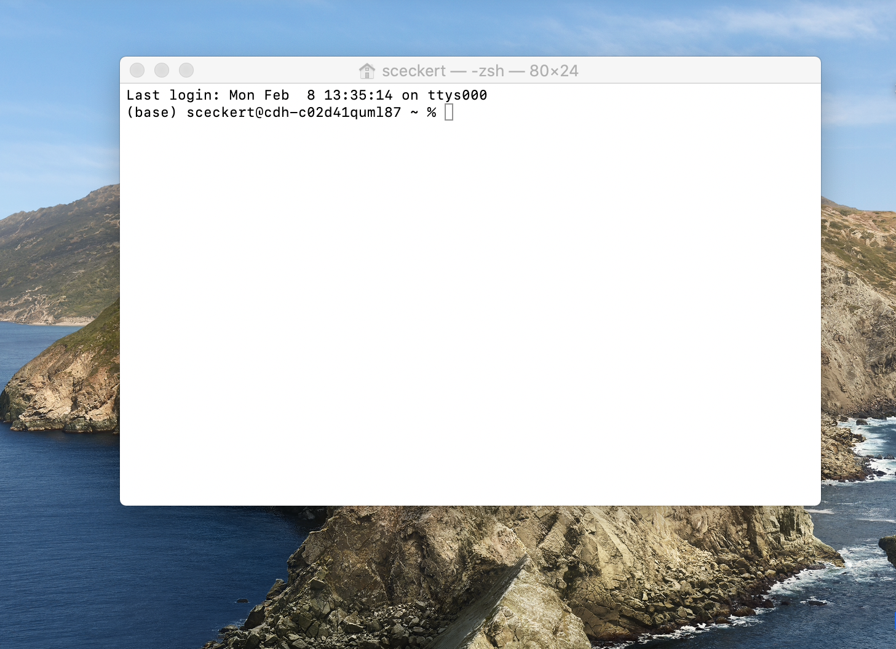

# Homework 2

## The Command Line

This week's getting you set ups for the command line, which we'll be working on in class on Thursday.

The command line is a way of interacting with your computer directly. It allows us to create files, run scripts (like in Python), fetch items from a remote server,  and perform some basic forms of analysis on files and on collections of files.

What we're going to do:

- Set up the command line
- Read and complete a short tutorial on the basic commands of the 
- Warm-up exercises and short reflection

## 1. Setting up the terminal

The command lines a  way of interacting directly with your computer, using human-readable text. The command line is sometimes called ––sometimes called the *Terminal* , the *shell*, or *bash*, –For more on the differences between each of these terms, see the [DHRI's excellent glossary.](https://github.com/DHRI-Curriculum/glossary/blob/v2.0/terms/command-line.md)

What *is* a command line? Many parts of your computer are designed as a "graphical user interface" –– you can interact with files, applications by clicking, and manipulating visual icons (those little virtual folders, files, and app icons). A command line allows you to do the same, but instead of interacting with icons, we interact through a single interface by typing in text commands.

### For Macs:

- On a Mac, the command line interface is called "the Terminal." 
- Navigate to "Applications" to a folder called "Utilities," then launch the Application called Terminal.  You should see the following:

The prompt displays the name of your machine, followed by a $ or %, depending on your set-up. This prompt is where you enter commands.

### For Windows:

- Unlike MacOS, which is Unix based shell, Windows uses a non-Unix based shell. Recent editions of Windows do include an emulator, called **PowerShell**, which include many (though not all) of the same commands as MacOS's Terminal
- To access Powershell, search for it it in the windows search bar, and click on the icon to launch it

## 2. Command line basics

Complete Ian Milligan and James Baker's[ "Introduction to the Bash Command Line" in *The Programming Historian*.](https://programminghistorian.org/en/lessons/intro-to-bash)

*Note*: Milligan and Baker's tutorial refers to **bash** language and something called the **bash shell**. (You can see the word "bash" at the top of their terminal screen) if you're running a Mac with a newer operating system, you might see something slightly different: "zsh". This means that you're running a z-shell, which is just an extension of bash. Rest assured, all of the commands written in this bash tutorial will still be able to run in ZSH.

## 3. Warm-up Exercises

Write down the commands you would input into the Terminal in order to do the following:

1. Move from a directory three levels up from your current directory...
2. ...then, tell me where I am
3. Move from your directory to a directory one level down called "sample-directory" ...
4. ...and then list the contents of that directory.
5. Display all of contents of Roosevelt's 1933 address from last class's corpus of [U.S. Inaugural Addresses](https://melaniewalsh.github.io/Intro-Cultural-Analytics/_downloads/b0f5605a8148b7b96b46cb1946f6d34e/US_Inaugural_Addresses.zip) (You may have to first download and unzip the file, if you didn't get a chance to do it last Thursday).
6. Display just the first 10 lines of that same Roosevelt speech.
7. Copy the text file of the address you have chosen to a new directory called "intro-DH"
8. Use the manual command to look up the commands "wc" and "grep"  (Hint: in Power)
	- Note:  in Window Powershell, these commands are slightly different than in the terminal: they are "help,"  "gc" and "findstr"), respectively, 
9. What sorts of things might the "wc" (or "gc" in Powershell) help you do? What sorts of things might the command "grep" allow you to do?

## 4. Reflection

Look back at what you've learned about the structure of the Unix shell and the few commands you learned. Write a few sentences reflecting on the following: How does Unix work? What was it like to interact with the computer through the command line? What do you notice about thew way that bash/zsh language is structured? Are there any connections that we might draw between Tara McPherson's essay from Tuesday or Paul Ford's article on the structure of code?